# Comparatif d'applis mobiles 📱 de contribution à OpenStreetMap

Ce tableau dresse un comparatif de 5 solutions mobiles à OpenStreetMap sur le plan de la **contribution** avec ajout de nœuds📌 voire de chemins〰 :

- Vespucci
- EveryDoor
- OSMGo
- OSMAnd
- Organic Maps

Le fabuleux outil **StreetComplete** n'est pas répertorié dans ce tableau car il ne permet pas d'ajouter des noeuds📌 ni des chemins〰 à la carte, mais seulement de les qualifier (et il le fait excellement bien.)

## Comparatif

| **Appli**                                                    | Vespucci                                          | EveryDoor                               | OSMGo                                                        | OSMAnd                                                       | **Organic** Maps                                             |
| ------------------------------------------------------------ | ------------------------------------------------- | --------------------------------------- | ------------------------------------------------------------ | ------------------------------------------------------------ | ------------------------------------------------------------ |
| 📌Ajout de NOEUDS                                             | ✔                                                 | ✔                                       | ✔                                                            | ✔                                                            | ✔                                                            |
| 📌Déplacement de NOEUDS existants                             | ✔                                                 | ✔                                       | ✔                                                            | ❌                                                            | ❌                                                            |
| ⚠Remarques                                                   |                                                   |                                         | Mais pas tous les objets, par ex. les arbres, mais pas les bancs |                                                              |                                                              |
| 〰Ajout et déplacement de CHEMINS                            | ✔                                                 | ❌                                       | ❌                                                            | ❌                                                            | ❌                                                            |
| 🧩Ajout de RELATIONS                                          | ✔                                                 | ❌                                       | ❌                                                            | ❌                                                            | ❌                                                            |
| 📜Ajout d'INFORMATIONS  (Ajout de tags sur des objets existants) | ✔                                                 | ✔                                       | ✔                                                            | ❌                                                            | ❌                                                            |
| ⚠Remarques                                                   |                                                   |                                         | Mais pas tous les objets                                     |                                                              |                                                              |
| 📜FORMULAIRES objets  (Ecrans de saisie personnalisés selon les tags) | ⭐⭐⭐⭐⭐                                             | ⭐⭐⭐⭐                                    | ⭐⭐⭐⭐⭐                                                        | ⭐⭐⭐                                                          | ⭐⭐⭐                                                          |
| ⚠Remarques                                                   |                                                   |                                         | Système de tags favoris assez sympa                          | Très nombreuses catégories  Mais formulaires **identiques** quel que soit le type Nom de la rue / Numéro de bâtiment / Téléphone / Site web / Description / Heures d’ouverture | Très nombreuses catégories  Mais formulaires **orientés Établissements Recevant du Public** quels que soient les objets (adresse, ouverture, ...) |
| 📜TAGS personnalisés (Possibilité de mettre n'importe quel tag 💪) | ✔                                                 | ❌                                       | ❌                                                            | ✔                                                            | ❌                                                            |
| ⚠Remarques                                                   |                                                   |                                         |                                                              | `Appuyer sur la carte > Créer un POI > Etendue` (cela permet d'avoir le mode étendu d'ajout de tags) |                                                              |
| 🗨Ajout de NOTES                                              | ✔                                                 | ✔                                       | ❌                                                            | ✔                                                            | ❌                                                            |
| ⚠Remarques                                                   |                                                   |                                         |                                                              | Via "Signaler une anomalie OSM"                              |                                                              |
| 📸Prise de PHOTOS                                             | ✔                                                 | ❌                                       | ❌                                                            | ❌                                                            | ❌                                                            |
| 🗺Fonds de CARTES                                             | ⭐⭐⭐⭐⭐                                             | ⭐                                       | ⭐⭐⭐                                                          | ⭐⭐⭐⭐⭐                                                        | ⭐                                                            |
| ⚠Remarques                                                   | Beaucoup de fonds dispos + ajout de fonds par URL | OSM Standard Photo Aérienne Mapbox | > 20 fonds                                                   | `Source de la carte > Ajouter plus > Microsoft Maps, Mapillary, Yandex, Geovelo, etc...`    `Source de la carte > Ajouter manuellement` | OSM (Randonnée / Terrain / Métro)                            |
| Photos MAPILLARY | ✔                                                 | ❌                                       | ❌                                                            | ✔                                                            | ❌                                                            |
| Connectivité RTK | à tester                                          | à tester                                | ❌                                                            | à tester                                                     | à tester                                                     |

✒**Conclusion**

- Pour un usage **expert** et **complet**, je recommande *Vespucci*

- Les applications *EveryDoor* et *OSMGo* sont particulièrement **simples** pour une contribution de type POI, sans se prendre trop la tête. J'apprécie davantage *EveryDoor* pour sa forte convivialité (son ergonomie et son mode de fonctionnement sont aussi simples que puissants,)

- Enfin, *OSMAnd* et *Organic Maps* sont à ranger davantage du côté des applications orientées vers la **consultation**. Elles permettent aussi de contribuer mais cela n'est leur fonctionnalité principale. S'il s'agit de contribuer via une de ces applications, je conseillerais davantage *OSMAnd* car il permet d'accéder à Mapillary et de renseigner tous les tags que l'on souhaite.

## Ecrans de saisie

Ici, nous illustrons les écrans de saisie personnalisés des applis EveryDoor, OSMGo, Vespucci, Organic Maps et OSMAnd pour les objets :

- Abri
- Banc
- Borne à incendie

### 🏚Abri

#### EveryDoor

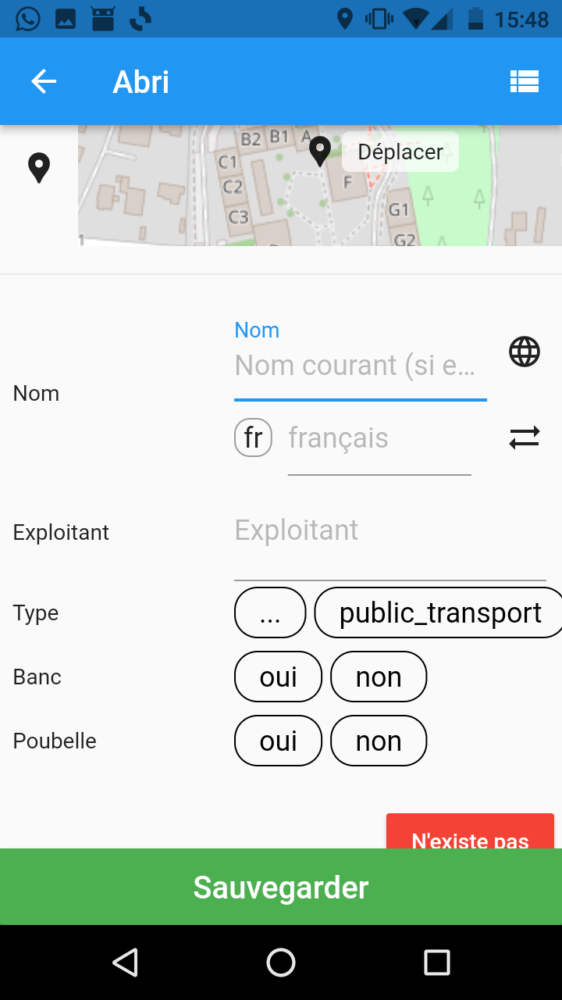

#### OSMGo

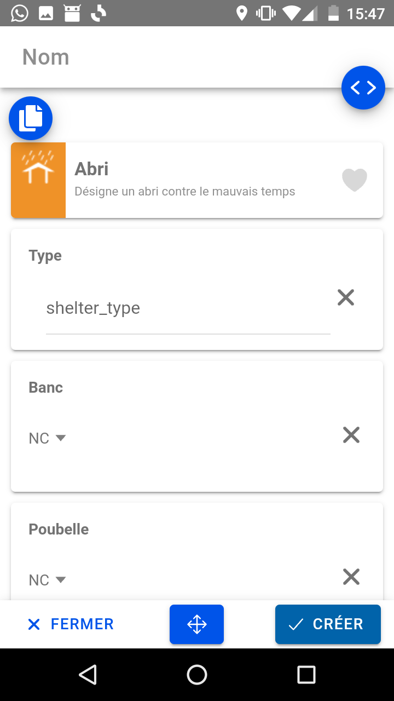

#### Vespucci

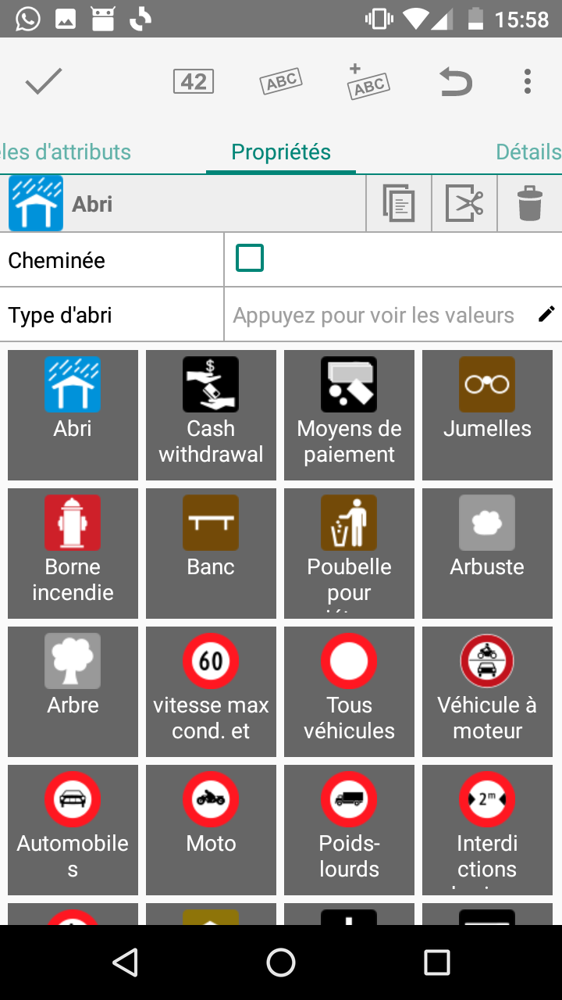

#### Organic Maps

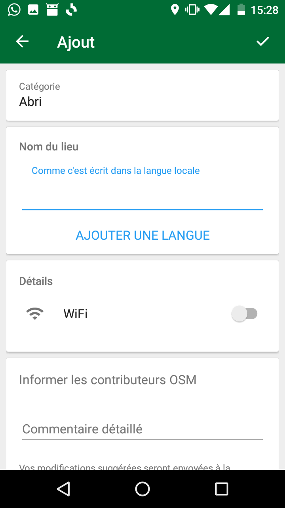

#### OSMAnd
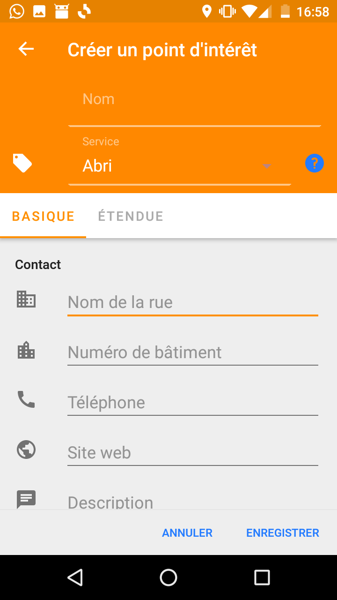
Le même formulaire est présenté quels que soient les objjets

### 🪑Banc

#### EveryDoor

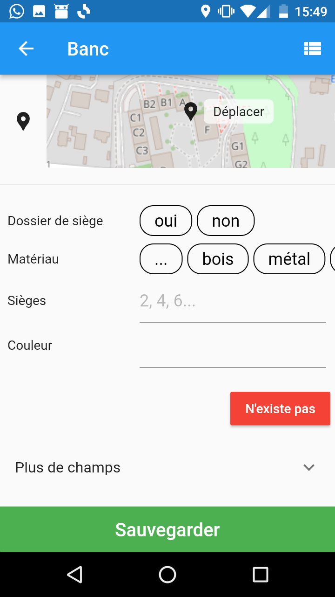

#### OSMGo

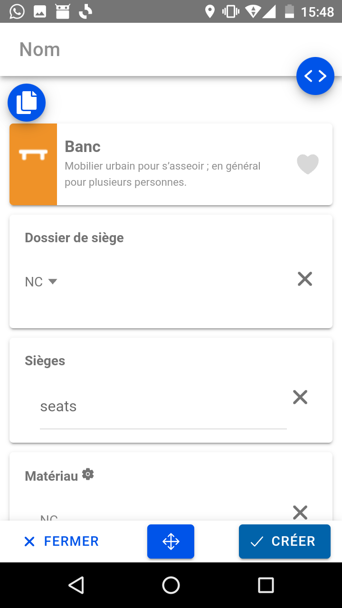

#### Vespucci

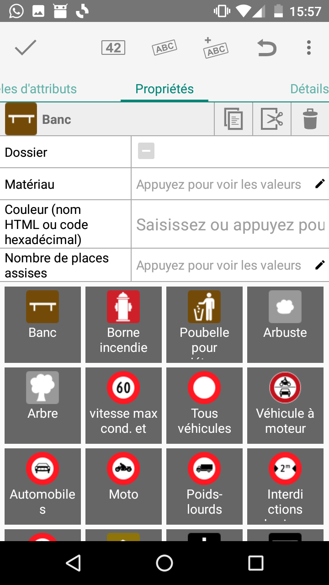

#### Organic Maps

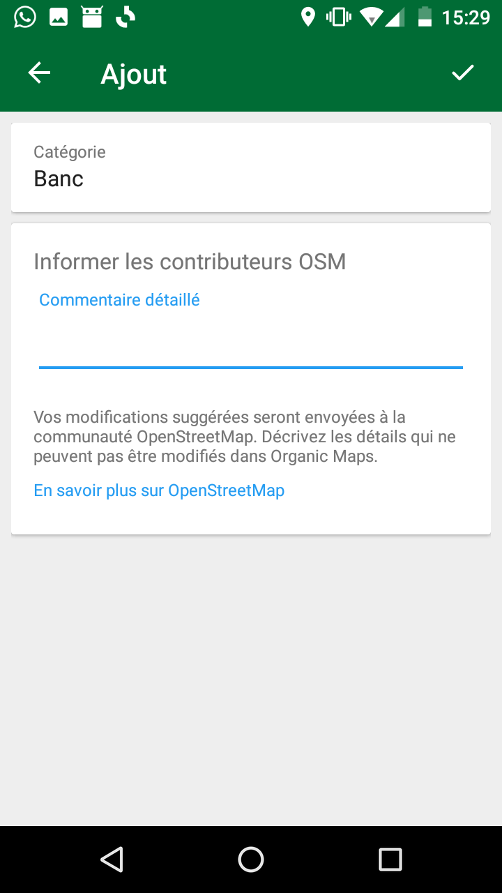

#### OSMAnd
Voir le formulaire "Abri" car le même formulaire est présenté quels que soient les objets

### 🧯Borne à incendie

#### EveryDoor

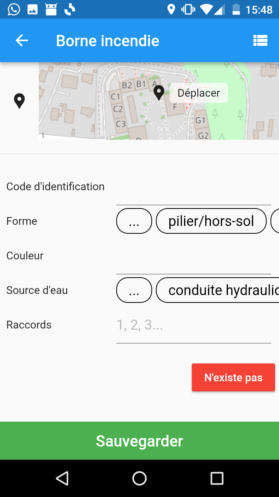

#### OSMGo

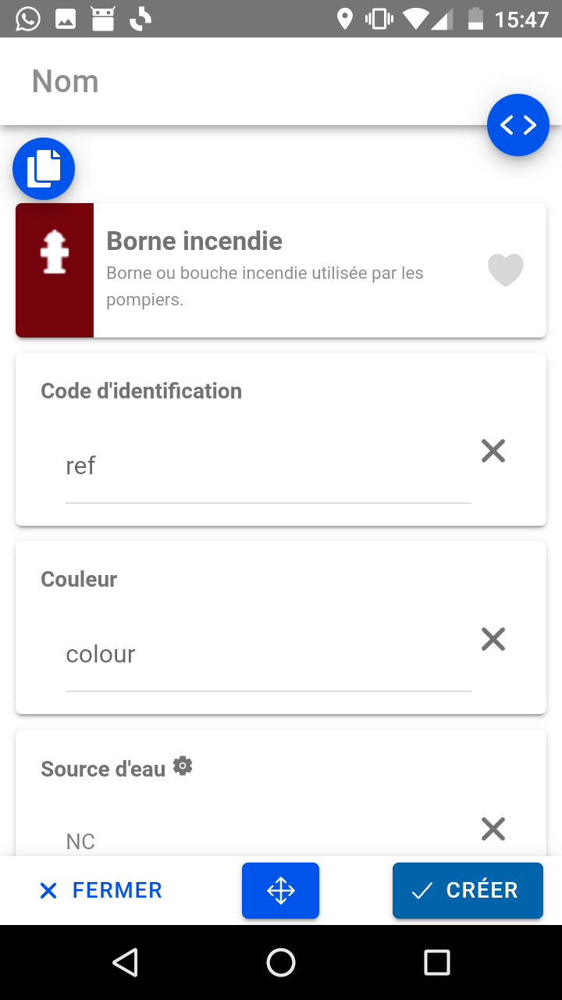

#### Vespucci

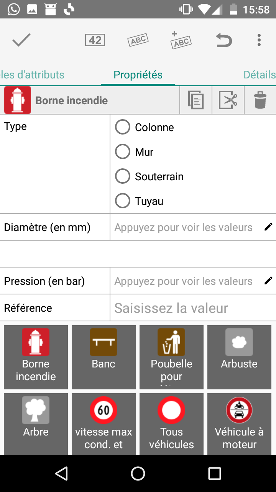

#### Organic Maps

